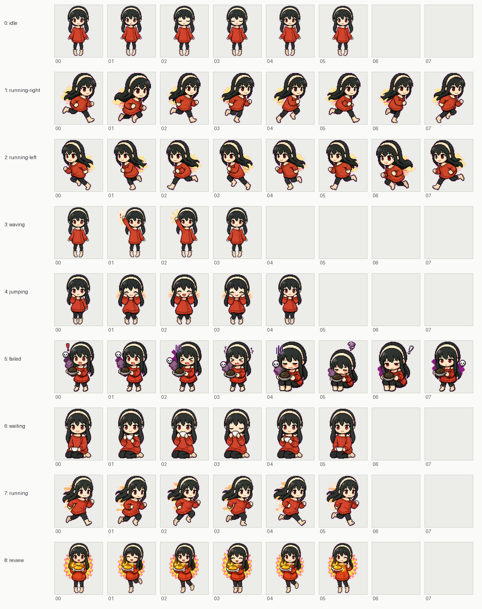

# Codex Pet Wardrobe Pack

Custom chibi pet sprite for the Codex desktop app.

This repository is prepared as a neutral public-sharing package. It intentionally avoids official character names, series names, logos, screenshots, and reference captures in package IDs and distributed assets.

## Pet

| Pet | Folder | Preview | Notes |
| --- | --- | --- | --- |
| Thorny Daily v1 | `pets/thorny-daily-v1` | `previews/thorny-daily-v1-contact-sheet.png` | Original cozy daily-outfit version. |

## Preview



## Install

Copy one pet folder into your Codex pets directory:

```sh
mkdir -p ~/.codex/pets
cp -R pets/thorny-daily-v1 ~/.codex/pets/
```

Then open Codex settings and choose the custom pet from Appearance > Pets.

If the pet list or sprite appears stale, use Refresh in the pets settings, then tuck away and wake the pet.

## Sprite Format

Each pet folder contains:

```text
pet.json
spritesheet.webp
spritesheet.png
```

Codex currently expects a `1536 x 1872` sprite atlas:

- 8 columns x 9 rows
- each cell is `192 x 208`
- transparent unused cells
- `spritesheet.webp` referenced from `pet.json`

See [docs/SPRITE_SPEC.md](docs/SPRITE_SPEC.md) for the row mapping.

## Validate

```sh
python3 scripts/pet_assets.py validate --atlas pets/thorny-daily-v1/spritesheet.webp
```

## Asset Notice

No open-source license is granted for the artwork assets in this repository. Treat the sprites as personal, non-commercial fan-work assets unless and until the designs are replaced with substantially original characters.

Code in `scripts/` may be reused for personal pet-building workflows.

## Public Sharing Caution

This pack was prepared to reduce public repository risk by using neutral names and excluding official artwork, but fan-made sprites can still raise IP concerns if they are recognizable as a protected character.

Before publishing publicly, read [docs/COPYRIGHT_AND_PUBLIC_SHARING.md](docs/COPYRIGHT_AND_PUBLIC_SHARING.md). A disclaimer does not grant permission from any rights holder.
